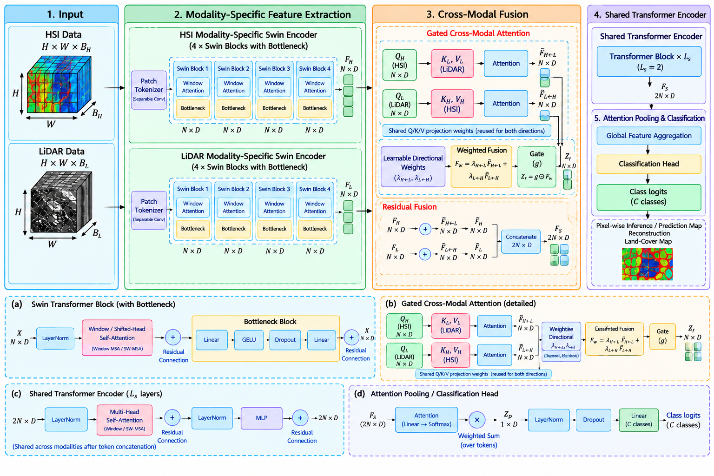

# GCMS: Gated Cross-Modal Swin Transformer with Bidirectional Attention for Hyperspectral–LiDAR Classification
 
Official implementation of **GCMS**, a compact multimodal Transformer for HSI–LiDAR land-use/land-cover (LULC) classification. GCMS combines modality-specific Swin-style encoders, bidirectional cross-modal attention, learnable directional weighting, and a data-dependent gate to adaptively fuse hyperspectral and LiDAR representations.
 
> **GCMS: Gated Cross-Modal Swin Transformer with Bidirectional Attention for Hyperspectral–LiDAR Classification**
> Boutheina Ouerhani, Manel Rhif, Ali Ben Abbes
> University of Manouba, Tunisia
 

## Highlights
 
- **Modality-specific Swin encoders**: separable-convolution tokenization + 4 stacked Swin-style window-attention blocks with bottleneck refinement, learned independently for HSI and LiDAR.
- **Gated bidirectional cross-modal fusion**: reciprocal cross-attention (H←L and L←H) combined via global learnable directional coefficients and a token/feature-wise sigmoid gate.
- **Residual fusion + shared Transformer encoder** refine the fused multimodal tokens before attention-pooling classification.
- **Extremely compact**: only **0.334M** trainable parameters — fewer than ExViT, SpectralFormer, and MSFMamba, comparable to MFT.
- **Robustness analysis**: tolerant to small horizontal HSI–LiDAR misregistration and mild HSI Poisson noise (without retraining).
## Results
 
| Dataset      | OA (%) | AA (%) | Kappa (%) |
|--------------|:------:|:------:|:---------:|
| Houston2013  | 92.51  | 93.41  | 91.87     |
| Trento       | 99.93  | 99.89  | 99.91     |
| MUUFL        | 92.18  | 92.97  | 89.68     |
 

 
## Repository Structure
 
```
Multimodal-Swin-Bottelneck-Transformer/
│ ├── model/
│ └── model.ipynb
│ ├── gcms-architecture.png
│ ├── .gitignore
├── LICENSE
└── README.md
```
 
> Adjust this tree to match your actual code layout before publishing.
 
## Datasets
 
GCMS is evaluated on three public HSI–LiDAR benchmarks:
 
| Dataset      | Scene size    | HSI bands | LiDAR bands | Classes | Patch size |
|--------------|---------------|:---------:|:-----------:|:-------:|:----------:|
| Houston2013  | 349 × 1905    | 144       | 1           | 15      | 14 × 14    |
| Trento       | 166 × 600     | 64        | 2           | 6       | 9 × 9      |
| MUUFL        | 325 × 220     | 64        | 2           | 11      | 11 × 11    |
 
Download links:
- Houston2013 — IEEE GRSS Data Fusion Contest 2013
- Trento — see [MDAS benchmark](https://essd.copernicus.org/articles/15/113/2023/)
- MUUFL — [GatorSense/MUUFLGulfport](https://github.com/GatorSense/MUUFLGulfport)
Place raw data under `data/<dataset_name>/` following the loader scripts' expected format, or update `configs/*.yaml` with your own paths. Train/test splits follow the standard predefined partitions used in prior work (see paper Section 4.2.1).
 
## Installation
 
```bash
git clone https://github.com/<your-username>/GCMS.git
cd GCMS
pip install -r requirements.txt
```
 
Suggested `requirements.txt`:
```
torch>=2.0
numpy
scipy
scikit-learn
einops
pyyaml
matplotlib
tqdm
```
 
## Usage
 
**Training**
```bash
python train.py --config configs/houston2013.yaml
```
 
**Evaluation**
```bash
python eval.py --config configs/houston2013.yaml --checkpoint checkpoints/gcms_houston2013.pth
```
 
**Pixel-wise inference / land-cover map**
```bash
python inference.py --config configs/houston2013.yaml --checkpoint checkpoints/gcms_houston2013.pth --output maps/houston2013_pred.png
```
 
## Key Hyperparameters
 
| Parameter | Value |
|---|---|
| Embedding dimension $D$ | 16 |
| Attention heads $h$ | 8 |
| Swin window size $M$ | 7 |
| Bottleneck reduction $r$ | 4 |
| Shared encoder layers $L_s$ | 2 |
| Feed-forward dim $D_{ff}$ | 64 |
| Dropout $p$ | 0.05 |
| Optimizer | AdamW, lr = 3×10⁻⁴, weight decay = 1×10⁻⁵ |
| Batch size | 64 |
| Epochs | 1000 (Houston2013) / 500 (MUUFL) / 200 (Trento) |
 

## License
 
Specify a license for your repository (e.g., MIT, Apache 2.0). If unspecified, the code defaults to "all rights reserved."
